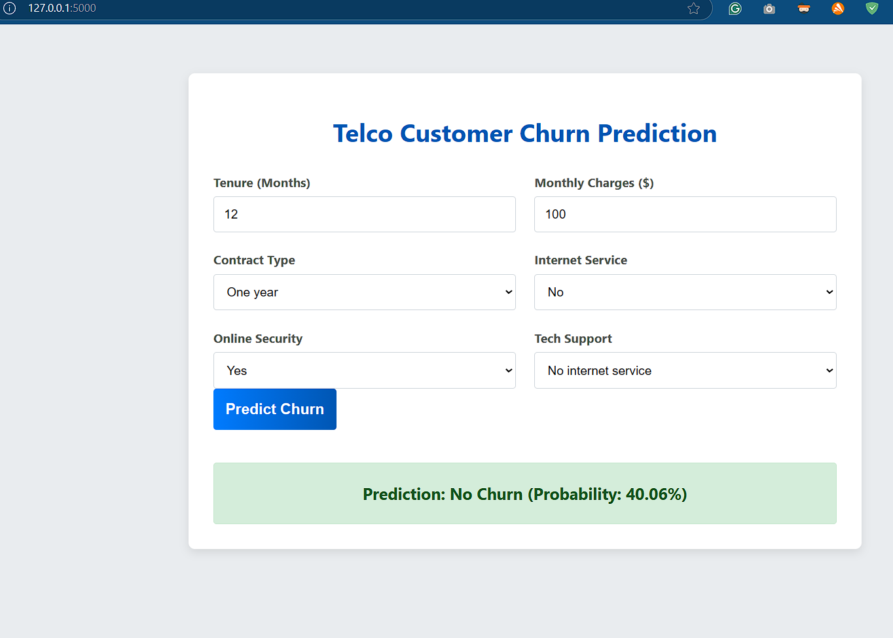

# Telco Customer Churn Prediction

This project builds a machine learning model to predict customer churn for a telecommunications company. It features a complete data analysis pipeline in a Jupyter Notebook and a Flask web application for real-time predictions.



## Project Objective

Customer churn is a major challenge for telecom companies, as retaining customers is more cost-effective than acquiring new ones. The goal is to develop an accurate, interpretable model to identify customers likely to churn, enabling proactive retention strategies.

## Features

- **Exploratory Data Analysis (EDA):** Comprehensive analysis in `Project_Report.ipynb` to uncover key churn factors.
- **Robust ML Pipeline:** Data preprocessing (scaling, encoding), class imbalance handling (SMOTE), and hyperparameter tuning for multiple models.
- **Interactive Web App:** Flask-based interface for instant churn predictions using new customer data.

## Project Structure

```
.
├── static/
│   └── style.css
├── templates/
│   └── index.html
├── Project_Report.ipynb
├── WA_Fn-UseC_-Telco-Customer-Churn.csv
├── app.py
├── churn_model.joblib
├── requirements.txt
└── README.md
```

## Technology Stack

- **Backend:** Python, Flask
- **Frontend:** HTML, CSS
- **Data Science & ML:** Pandas, NumPy, Scikit-learn, Imbalanced-learn, XGBoost, LightGBM, Joblib
- **Visualization:** Matplotlib, Seaborn

## Setup and Installation

1. **Clone the repository:**
    ```bash
    git clone https://github.com/T-srikrishna/telco-churn-prediction.git
    cd telco-churn-prediction
    ```

2. **Create and activate a virtual environment:**
    - *Windows:*
      ```bash
      python -m venv venv
      .\venv\Scripts\activate
      ```
    - *macOS/Linux:*
      ```bash
      python3 -m venv venv
      source venv/bin/activate
      ```

3. **Install dependencies:**
    ```bash
    pip install -r requirements.txt
    ```

## How to Use

### 1. Run the Web Application

A pre-trained model (`churn_model.joblib`) is included. Start the Flask app from the project root:

```bash
flask run
```
or
```bash
python app.py
```

Visit [http://127.0.0.1:5000](http://127.0.0.1:5000) to input customer details and predict churn.

### 2. Explore Analysis & Model Training

Run the Jupyter Notebook for full data analysis and model training:

```bash
jupyter notebook Project_Report.ipynb
```

## Final Model Details

The selected model is a **Tuned Logistic Regression**, chosen after evaluating five algorithms (Random Forest, XGBoost, LightGBM, Neural Network):

- **Highest Recall (79.7%):** It was the best model at identifying customers who will actually churn. For a retention campaign, it is far more costly to miss a potential churner (a false negative) than it is to mistakenly target a loyal customer (a false positive).
- **High Interpretability:** Its linear nature makes it easy to understand and explain which factors (e.g., contract type, monthly charges) are influencing the predictions, a crucial feature for business stakeholders.
- **Simplicity and Efficiency:** It is computationally efficient, making it fast to train and easy to deploy.

The model was trained using a full pipeline incorporating data preprocessing (`StandardScaler` for numerical features, `OneHotEncoder` for categorical features) and SMOTE (Synthetic Minority Over-sampling Technique) to effectively handle the class imbalance in the dataset.
