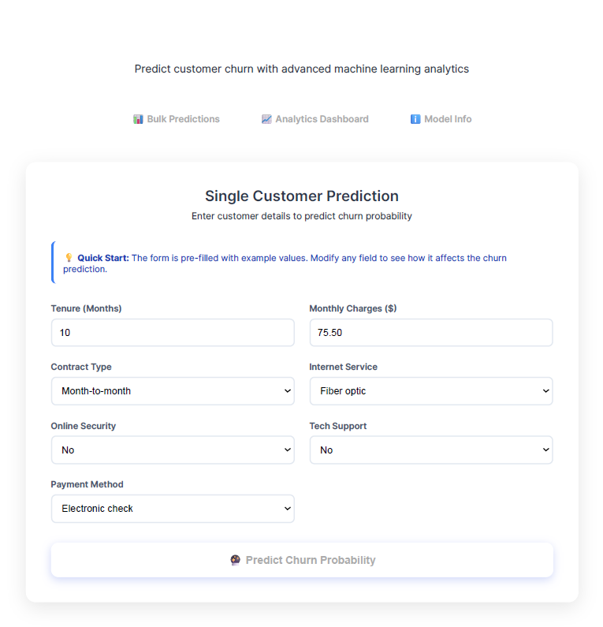
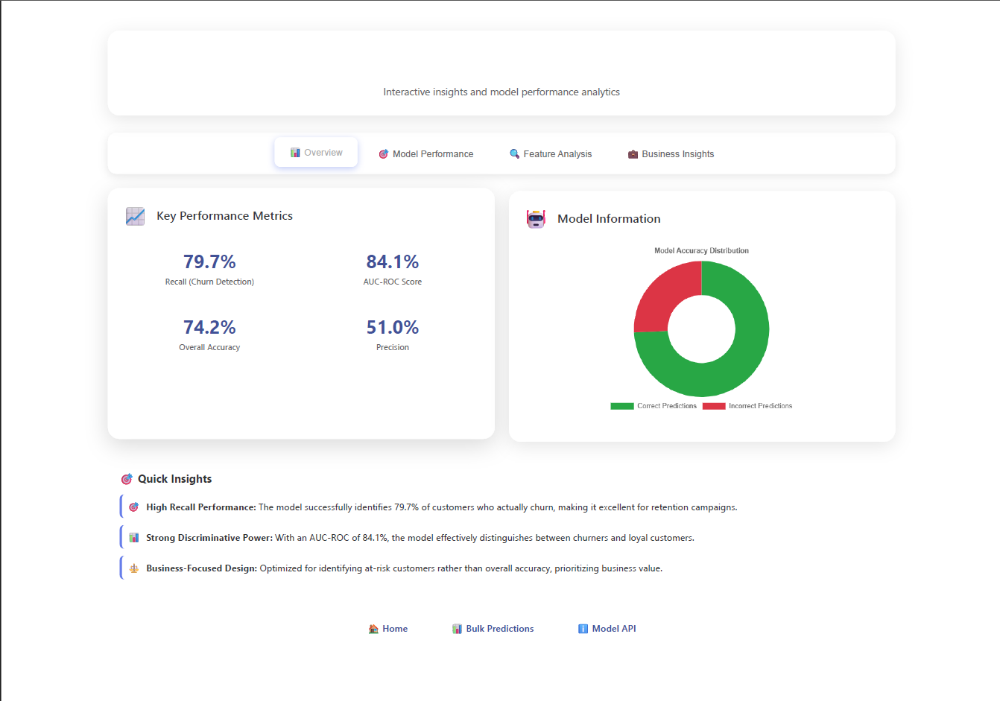

# Telco Customer Churn Prediction

This project builds a machine learning model to predict customer churn for a telecommunications company. It features a complete data analysis pipeline in a Jupyter Notebook and a Flask web application for real-time predictions.

## Screenshots

### Home Page - Modern Prediction Interface


### Analytics Dashboard - Interactive Insights


## Project Objective

Customer churn is a major challenge for telecom companies, as retaining customers is more cost-effective than acquiring new ones. The goal is to develop an accurate, interpretable model to identify customers likely to churn, enabling proactive retention strategies.

## Features

- **Comprehensive Data Analysis:** Interactive Jupyter Notebook (`Project_Report.ipynb`) with Plotly visualizations for in-depth churn factor exploration.
- **Advanced ML Pipeline:** Data preprocessing (scaling, encoding), class imbalance handling (SMOTE), and hyperparameter tuning across multiple algorithms.
- **Modern Web Application:** Flask-based interface with professional UI/UX design for instant churn predictions.
- **Bulk Processing System:** Upload CSV/Excel files to predict churn for multiple customers simultaneously with downloadable results.
- **Interactive Analytics Dashboard:** 
  - Real-time feature importance visualizations with filtering (All Features, Risk Factors, Retention Factors)
  - Model performance metrics with confusion matrix heatmaps
  - Business impact analysis with calculated churn reduction scenarios
  - Dynamic donut charts and responsive design
- **Professional UI/UX:** Glass morphism design, gradient backgrounds, responsive layouts, and smooth animations.
- **Data Export:** Download prediction results with risk levels, probabilities, and business recommendations.

## Project Structure

```
.
├── static/
│   └── style.css
├── templates/
│   ├── index.html
│   ├── analytics.html
│   └── bulk_predict.html
├── uploads/
│   └── .gitkeep
├── screenshots/
│   ├── Homepage.png
│   ├── DashPage.png
│   └── web.png
├── Project_Report.ipynb
├── Telco-Customer-Churn.csv
├── app.py
├── churn_model.joblib
├── requirements.txt
├── .gitignore
└── README.md
```

## Technology Stack

- **Backend:** Python, Flask, Werkzeug
- **Frontend:** HTML5, CSS3, JavaScript (ES6+)
- **Data Science & ML:** Pandas, NumPy, Scikit-learn, Imbalanced-learn, XGBoost, LightGBM, Joblib
- **Interactive Visualizations:** Plotly.js, Chart.js, Matplotlib, Seaborn
- **UI/UX:** Modern responsive design with glass morphism effects and gradient backgrounds
- **File Processing:** OpenPyXL for Excel files, Pandas for CSV processing

## Prerequisites

- Python 3.7 or higher
- pip package manager

## Setup and Installation

1. **Clone the repository:**
    ```bash
    git clone https://github.com/T-srikrishna/telco-churn-prediction.git
    cd telco-churn-prediction
    ```

2. **Create and activate a virtual environment:**
    - *Windows:*
      ```bash
      python -m venv venv
      .\venv\Scripts\activate
      ```
    - *macOS/Linux:*
      ```bash
      python3 -m venv venv
      source venv/bin/activate
      ```

3. **Install dependencies:**
    ```bash
    pip install -r requirements.txt
    ```

## How to Use

### 1. Run the Web Application

A pre-trained model (`churn_model.joblib`) is included. Start the Flask app from the project root:

```bash
flask run
```
or
```bash
python app.py
```

Visit [http://127.0.0.1:5000](http://127.0.0.1:5000) to input customer details and predict churn.

**Web App Features:**
- **Single Prediction:** Modern form interface with real-time validation for instant churn prediction
- **Bulk Predictions:** Upload CSV/Excel files with multiple customers for batch processing (up to 16MB)
- **Interactive Analytics Dashboard:** 
  - **Overview Tab:** Key performance metrics and model accuracy visualization
  - **Performance Tab:** Detailed metrics with interactive confusion matrix heatmap
  - **Feature Analysis Tab:** Dynamic charts with filtering options (All Features, Risk Factors, Retention Factors)
  - **Business Insights Tab:** Calculated churn reduction scenarios and actionable recommendations
- **Professional Design:** Glass morphism UI with responsive design, smooth animations, and gradient backgrounds
- **Sample Template:** Download CSV template with required column format and sample data
- **Data Validation:** Built-in validation for uploaded files with helpful error messages

### 2. Bulk Predictions

For processing multiple customers:

1. Navigate to the **Bulk Predictions** page from the main interface
2. Download the sample template to see the required data format
3. Prepare your customer data in CSV or Excel format with the following columns:
   ```
   gender, SeniorCitizen, Partner, Dependents, tenure, PhoneService, 
   MultipleLines, InternetService, OnlineSecurity, OnlineBackup, 
   DeviceProtection, TechSupport, StreamingTV, StreamingMovies, 
   Contract, PaperlessBilling, PaymentMethod, MonthlyCharges, TotalCharges
   ```
4. Upload your file (max 16MB)
5. Download the results with predictions, probabilities, and risk levels

### 3. Explore Interactive Analysis & Model Training

Run the Jupyter Notebook for full data analysis with interactive Plotly visualizations:

```bash
jupyter notebook Project_Report.ipynb
```

**New Notebook Features:**
- **Interactive Plotly Charts:** Hover effects, zoom, and filtering capabilities
- **Feature Importance Analysis:** Color-coded visualizations showing impact on churn
- **Model Comparison:** Comprehensive evaluation of multiple algorithms
- **Business Insights:** Actionable recommendations based on feature analysis

## Model Performance

| Metric | Value |
|--------|-------|
| Recall (Churn Detection) | 79.7% |
| AUC-ROC Score | 84.1% |
| Overall Accuracy | 74.2% |
| Precision (Churn) | 51% |

## Analytics Dashboard Features

The interactive dashboard provides comprehensive insights into model performance and business impact:

### Overview Tab
- **Key Metrics Cards:** Recall (79.7%), AUC-ROC (84.1%), Accuracy (74.2%), Precision (51.0%)
- **Model Summary:** Visual accuracy distribution with donut chart
- **Quick Insights:** Business-focused interpretation of model performance

### Performance Tab  
- **Metrics Comparison:** Interactive bar chart showing all performance metrics
- **Confusion Matrix:** Plotly heatmap with hover details and actual prediction counts

### Feature Analysis Tab
- **Dynamic Filtering:** Switch between All Features, Risk Factors, and Retention Factors
- **Feature Importance:** Horizontal bar chart showing coefficient values with color coding
- **Impact Analysis:** Donut charts showing feature category distributions
- **Real-time Updates:** Charts update instantly when switching between filter options

### Business Insights Tab
- **Churn Reduction Scenarios:** Calculated projections based on feature coefficients
- **Strategy Recommendations:** Actionable business strategies with expected impact
- **ROI Analysis:** Data-driven recommendations for customer retention programs

## Key Business Insights

Based on the logistic regression coefficients, the model identified these critical churn predictors:

### Strongest Retention Factors (Negative Coefficients)
- **Two-Year Contracts** (-1.443): Most powerful retention factor
- **Tenure** (-0.456): Longer customer relationships reduce churn risk
- **One-Year Contracts** (-0.433): Better than month-to-month but less effective than two-year
- **Online Security** (-0.187): Additional services increase customer loyalty

### Highest Risk Factors (Positive Coefficients)  
- **Fiber Optic Service** (+0.622): Higher churn rates, possibly due to pricing or service issues
- **Electronic Check Payment** (+0.445): Payment method correlates with higher churn
- **Monthly Charges** (+0.234): Higher monthly costs increase churn probability
- **Total Charges** (+0.198): Overall spend relationship with churn risk

### Strategic Recommendations
1. **Contract Strategy:** Offer incentives for annual/two-year contract upgrades
2. **Payment Optimization:** Encourage automatic payment methods with discounts
3. **Service Quality:** Review fiber optic pricing and service delivery
4. **New Customer Focus:** Implement 90-day onboarding programs for tenure building

## Final Model Details

The selected model is a **Tuned Logistic Regression**, chosen after evaluating five algorithms (Random Forest, XGBoost, LightGBM, Neural Network):

- **Highest Recall (79.7%):** It was the best model at identifying customers who will actually churn. For a retention campaign, it is far more costly to miss a potential churner (a false negative) than it is to mistakenly target a loyal customer (a false positive).
- **High Interpretability:** Its linear nature makes it easy to understand and explain which factors (e.g., contract type, monthly charges) are influencing the predictions, a crucial feature for business stakeholders.
- **Simplicity and Efficiency:** It is computationally efficient, making it fast to train and easy to deploy.

The model was trained using a full pipeline incorporating data preprocessing (`StandardScaler` for numerical features, `OneHotEncoder` for categorical features) and SMOTE (Synthetic Minority Over-sampling Technique) to effectively handle the class imbalance in the dataset.

## Troubleshooting

- **Import Errors**: Ensure all dependencies are installed with `pip install -r requirements.txt`
- **Jupyter Issues**: Try running `jupyter notebook --allow-root` if you encounter permission issues
- **Flask App Won't Start**: Check that port 5000 is available or modify the port in `app.py`
- **Model Loading Errors**: Ensure `churn_model.joblib` is in the project root directory
- **File Upload Issues**: Check file format (CSV/Excel) and size limit (16MB max)

## Project Status

✅ **Production Ready**: This project is fully functional and ready for deployment  
✅ **Modern UI/UX**: Professional glass morphism design with responsive layouts  
✅ **Interactive Analytics**: Dynamic charts with real-time filtering and business insights  
✅ **Comprehensive Documentation**: Complete setup instructions and feature descriptions  
✅ **Business Value**: Actionable insights with calculated ROI projections
